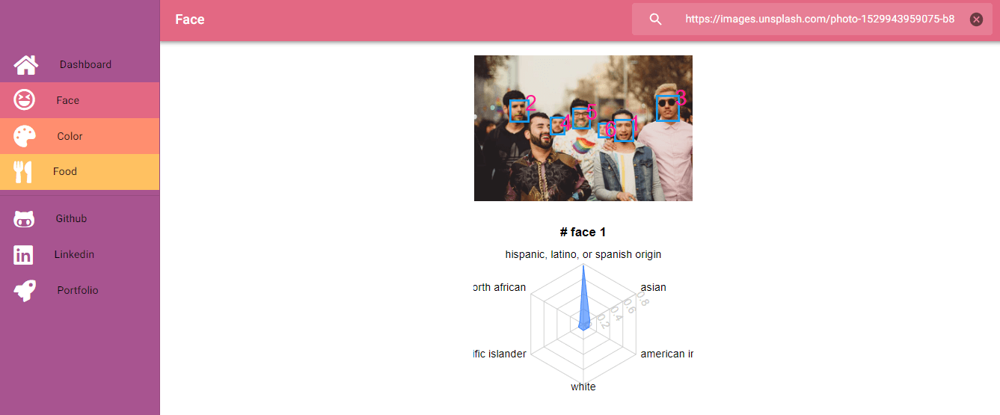

# boda : [viewing or watching] in Korean
> Object Recognition Web App



It's an object recognition web app. Currently only face, color and food can be detected. It also analyzes a person's age and ethnicity. Give it a try. It's fun to see how old I look like by AI. This web app is built with react, redux and react-router-dom v4.

## Getting Started

### Prerequisites

If you don't have Node.js setup on your computer, please click below link and download it first.

* [Node.js](https://nodejs.org/en/) - The official Node.js website to download

### Installing

If you already have Node.js, then follow below step.

On your terminal:

```
cd /c/<folder_path>
git https://github.com/april9288/boda.git
cd boda
npm install
npm start

```

So it will automatically run in your local server.

## Built With

* [React.js](https://reactjs.org/) - The official React.js website
* [Redux.js](https://redux.js.org/) - It's a Javascript library helps manage React state
* [React Router](https://reacttraining.com/react-router/) - Routing solution for React.js
* [Clarifai Object Recognition API](https://clarifai.com/) - It's Clarifai's website

## Meta

James Jongho Kim 
- [Portfolio](https://april9288.github.io/) - It's my portfolio website
- [Github](https://github.com/april9288) - This is my Github page
- [Linkedin](https://www.linkedin.com/in/jongho-kim-b05618170/) - This is my Linkedin page
- april9288@gmail.com
